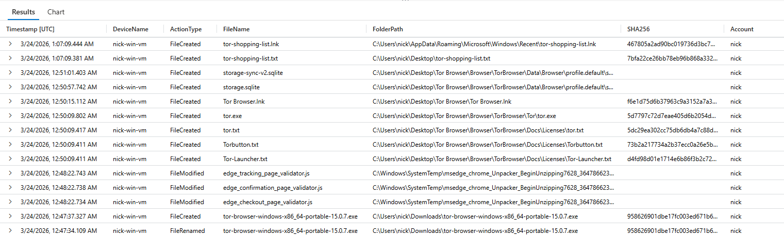
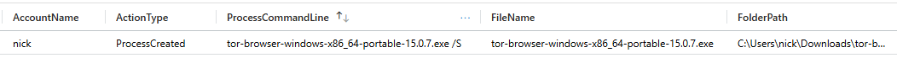
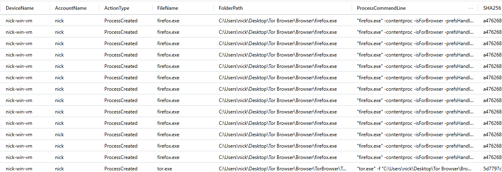
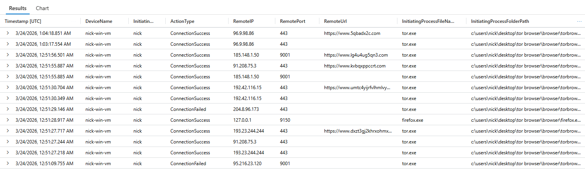

# Threat Hunt Report: Unauthorized TOR Usage

- [Scenario Creation](https://github.com/nklpawar/unauthorized-tor-usage-investigation/blob/main/scenario-creation-tor.md)

---

## Platforms and Technologies Used
- Windows 11 Pro Virtual Machine (Microsoft Azure)
- Microsoft Defender for Endpoint (MDE)
- Kusto Query Language (KQL)
- TOR Browser

---

## Scenario

This investigation was initiated after management observed unusual encrypted outbound traffic patterns and suspected possible misuse of anonymization tools such as TOR within the environment.

There were also informal reports suggesting that employees may be attempting to bypass network restrictions to access blocked or monitored content.

The objective of this threat hunt was to validate whether TOR was being used on any corporate-managed endpoint and, if so, to analyze the activity and determine its impact.

---

## Investigation Approach

To validate TOR usage, the hunt was structured across three key areas:

- **File Activity** → Identify TOR-related files and artifacts  
- **Process Activity** → Detect installation and execution behavior  
- **Network Activity** → Confirm TOR-based outbound connections  

---


## Steps Taken

### 1. File Activity Analysis – `DeviceFileEvents`

Initial analysis focused on identifying TOR-related file activity.

Evidence shows that a user (`nick`) downloaded a TOR installer and multiple TOR-related files were written to disk. A file named `tor-shopping-list.txt` was also created.

Activity began around `2026-03-24T00:47:34.1097084Z`, which was used as the starting point for further investigation.

**Query used:**

```kql
DeviceFileEvents  
| where DeviceName == "nick-win-vm"  
| where InitiatingProcessAccountName == "nick"  
| where FileName contains "tor"  
| where Timestamp >= datetime('2026-03-24T00:47:34.1097084Z')  
| order by Timestamp desc  
| project Timestamp, DeviceName, ActionType, FileName, FolderPath, SHA256, Account = InitiatingProcessAccountName
```



---

### 2. Process Analysis – TOR Installation

Process logs were reviewed to confirm how the installer was executed.

Logs indicate that the TOR installer was run with a silent install flag (`/S`), which reduces user interaction and can be used to avoid attention.

**Query used:**

```kql
DeviceProcessEvents  
| where DeviceName == "nick-win-vm"  
| where ProcessCommandLine contains "tor-browser-windows-x86_64-portable-15.0.7.exe"  
| project Timestamp, DeviceName, AccountName, ActionType, FileName, FolderPath, SHA256, ProcessCommandLine
```



---

### 3. Process Analysis – TOR Execution

Further validation confirmed that TOR was actually launched.

Multiple instances of `tor.exe` and `firefox.exe` were observed, confirming that the browser was actively used.

**Query used:**

```kql
DeviceProcessEvents  
| where DeviceName == "threat-hunt-lab"  
| where FileName has_any ("tor.exe", "firefox.exe", "tor-browser.exe")  
| project Timestamp, DeviceName, AccountName, ActionType, FileName, FolderPath, SHA256, ProcessCommandLine  
| order by Timestamp desc
```



---

### 4. Network Analysis – TOR Activity

Network telemetry confirmed active TOR communication.

Connections were observed over known TOR ports including `9001`, along with HTTPS traffic (`443`) and local proxy communication (`127.0.0.1:9150`).

This confirms anonymized browsing activity.

**Query used:**

```kql
DeviceNetworkEvents  
| where DeviceName == "threat-hunt-lab"  
| where InitiatingProcessAccountName != "system"  
| where InitiatingProcessFileName in ("tor.exe", "firefox.exe")  
| where RemotePort in ("9001", "9030", "9040", "9050", "9051", "9150", "80", "443")  
| project Timestamp, DeviceName, InitiatingProcessAccountName, ActionType, RemoteIP, RemotePort, RemoteUrl, InitiatingProcessFileName, InitiatingProcessFolderPath  
| order by Timestamp desc
```



---

## Timeline of Events

1. TOR installer downloaded onto the system  
2. Installer executed silently using `/S`  
3. TOR browser processes launched (`tor.exe`, `firefox.exe`)  
4. Network connections established over TOR-related ports  
5. User created and deleted a file (`tor-shopping-list.txt`)  

---

## MITRE ATT&CK Mapping

| Tactic | Technique | Description |
| :--- | :--- | :--- |
| **Execution** | [User Execution (T1204.002)](https://attack.mitre.org/techniques/T1204/002/) | The user manually initiated the TOR installer, representing a deliberate policy violation. |
| **Defense Evasion** | [Impair Defenses (T1562)](https://attack.mitre.org/techniques/T1562/) | The installer was executed with a silent flag (`/S`) to suppress UI notifications and bypass visual detection. |
| **Defense Evasion** | [Indicator Removal (T1070.004)](https://attack.mitre.org/techniques/T1070/004/) | The user manually deleted the `tor-shopping-list.txt` file to clear evidence of their activity on the host system. |
| **Defense Evasion** | [Proxy (T1090)](https://attack.mitre.org/techniques/T1090/) | TOR was used to encapsulate traffic, bypassing organizational web filters and anonymizing outbound connections. |
---

## Analyst Notes

- Initial hypothesis was based on unusual encrypted traffic patterns  
- File activity confirmed presence of TOR installer and artifacts  
- Silent installation stood out as slightly suspicious behavior  
- Process telemetry validated that TOR was actually executed  
- Network logs were the strongest confirmation of real usage  

One important takeaway here is that **TOR usage itself is not inherently malicious**, but in a corporate environment, it significantly reduces visibility and increases risk.

This makes it important to treat such activity with higher priority than typical Shadow IT cases.

---

## Detection Gaps and Improvements

- No alert triggered on TOR installation or execution  
- TOR network traffic was not blocked or flagged automatically  
- Lack of application control allowed unauthorized installation  

### Suggested Improvements

- Implement application allowlisting (e.g., AppLocker or Defender Application Control)  
- Create custom detections for TOR-related process names and ports  
- Monitor and alert on anonymization tools (TOR, VPN clients, proxies)  
- Enhance network-level monitoring for suspicious encrypted traffic patterns  

---

## Summary

The investigation confirmed that the user `employee` installed and actively used the TOR browser on a corporate endpoint.

Key observations:
- Silent installation of TOR  
- Execution of TOR processes  
- Network communication over TOR-related ports  
- Local file activity associated with usage  

Although this began as a Shadow IT scenario, the use of TOR increases the potential risk due to its ability to anonymize traffic and bypass monitoring controls.

---


## Response Actions

- TOR usage confirmed on endpoint  
- Device isolated from network  
- Management notified for further action  
